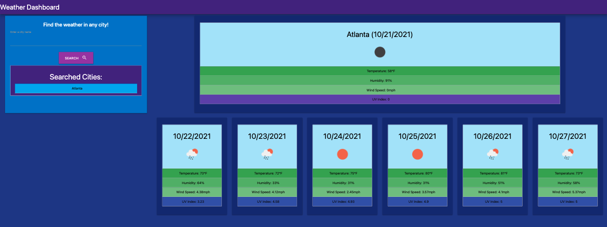

# 06 Server-Side APIs: Weather Dashboard

## City Search

The landing page of this website allows you to search for any city and get weather results for today's forecast, and for a weekly forecast

## Search Results

Once a city has been searched, it is saved as a recent search button that can be clicked at any time. This allows you to toggle back and forth between selected cities. 

The first card on the page shows today's weather forecast, and includes the date, an icon representative of the weather, temperature, humidity, wind speed, and UV index. 

Subsequent cards on the page show the weekly forecast which contain similar results

## Styling
For the styling of the website, I went with blue, purple, and green tones as they reflect the sky and the earth.

The UV index list item will change background color from light blue to dark purple respective to it's intensity. 

